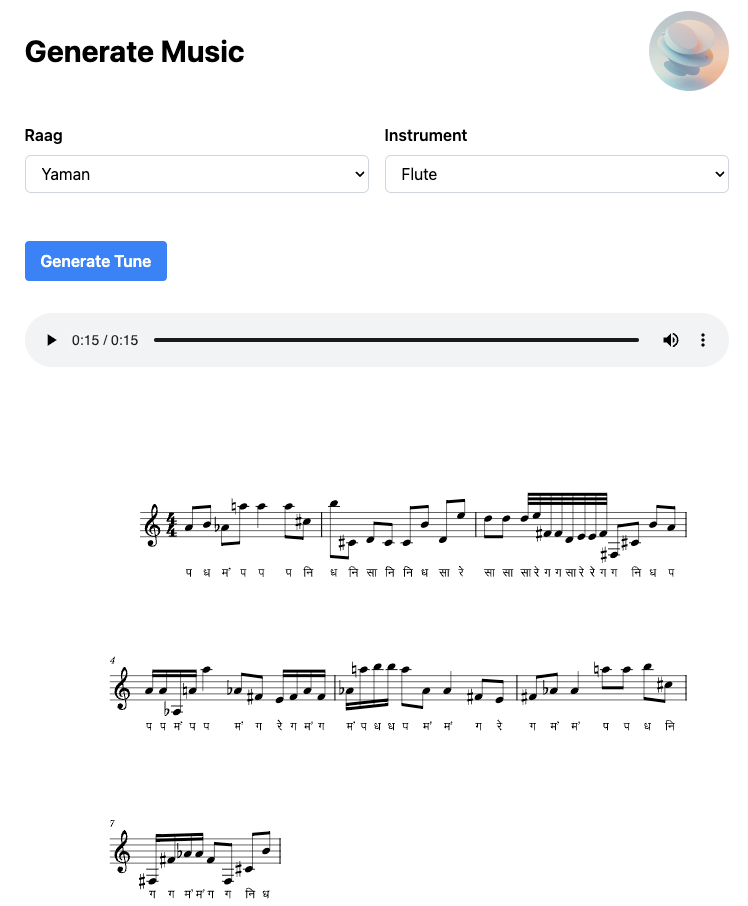

Demo :

http://raag.shamit.in/ui 

Local installation :

1. Create a Python virtual environment (>= 3.10)
2. Install dependencies [requirements.txt](setup%2Frequirements.txt)
3. Start server [run_server.sh](run_server.sh)
4. Open UI in browser http://localhost:9060/ui

